# Mini MES

A manufacturing execution system for a lithium-ion battery electrode line, covering the four steps Mixing → Coating → Calendering → Slitting. It is built with ASP.NET Core, React and PostgreSQL, and a machine simulator feeds it live readings and alarms.

## Screenshots

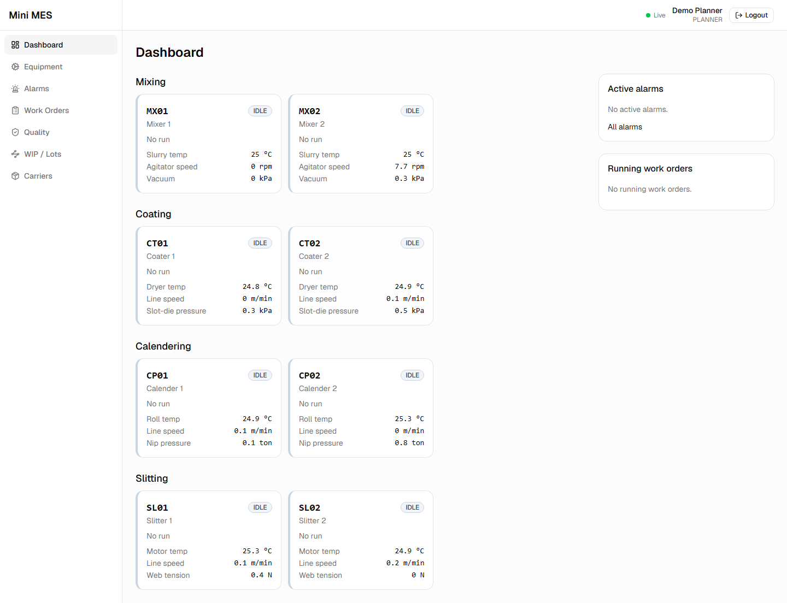

<table>
  <tr>
    <td width="50%">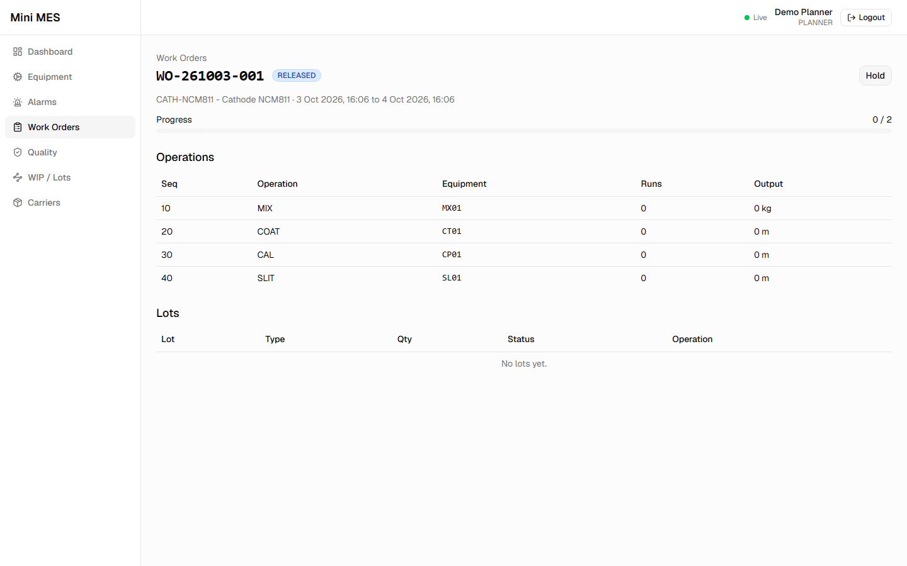<br>A released work order for 2 cathode pancakes, with one machine assigned to each route step.</td>
    <td width="50%">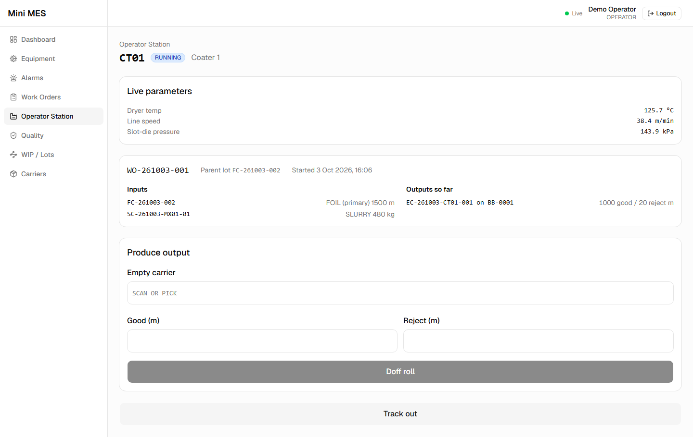<br>Operator station on coater CT01: the open run, its input lots, the doffed roll and live parameters.</td>
  </tr>
  <tr>
    <td width="50%">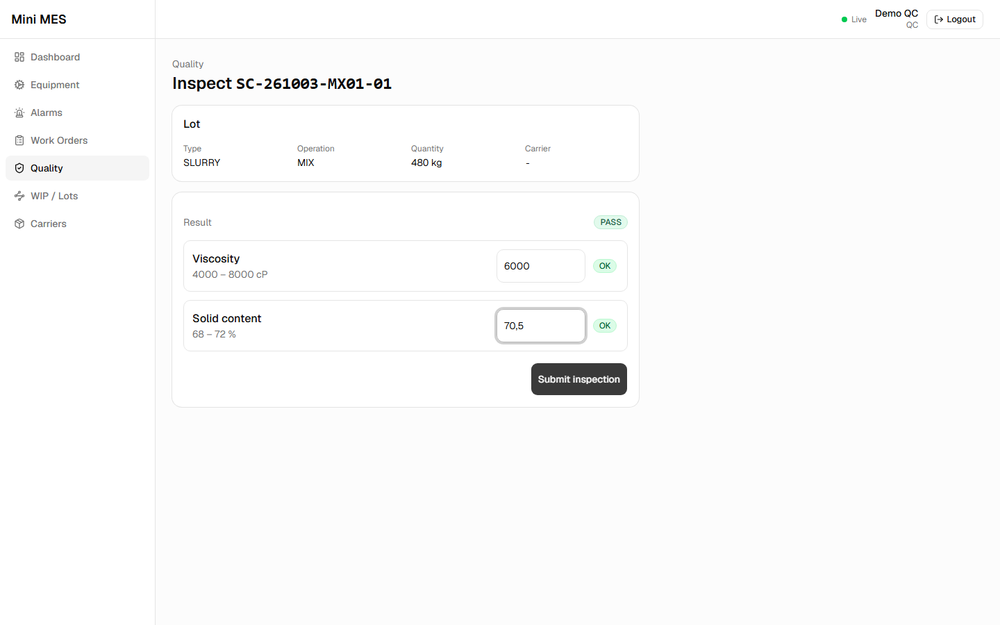<br>QC inspects a slurry lot. Each value is judged against its limits as it is typed.</td>
    <td width="50%">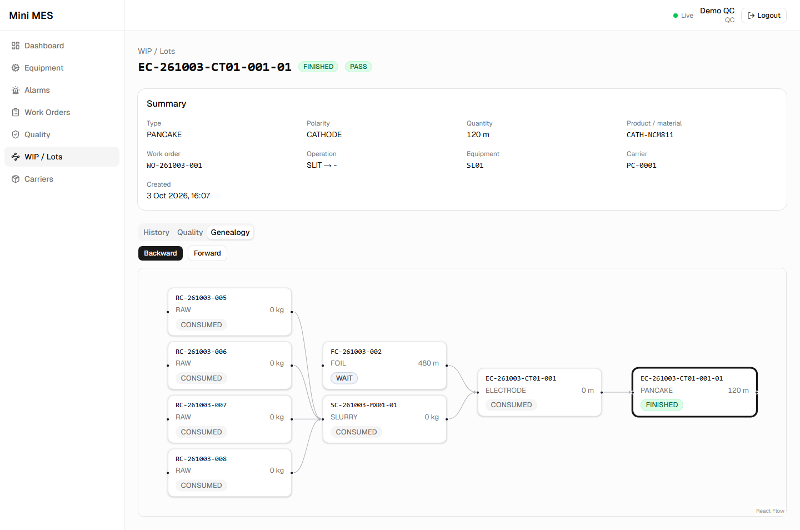<br>Backward genealogy of a pancake, from the electrode roll down to the foil, slurry and raw material lots.</td>
  </tr>
  <tr>
    <td width="50%">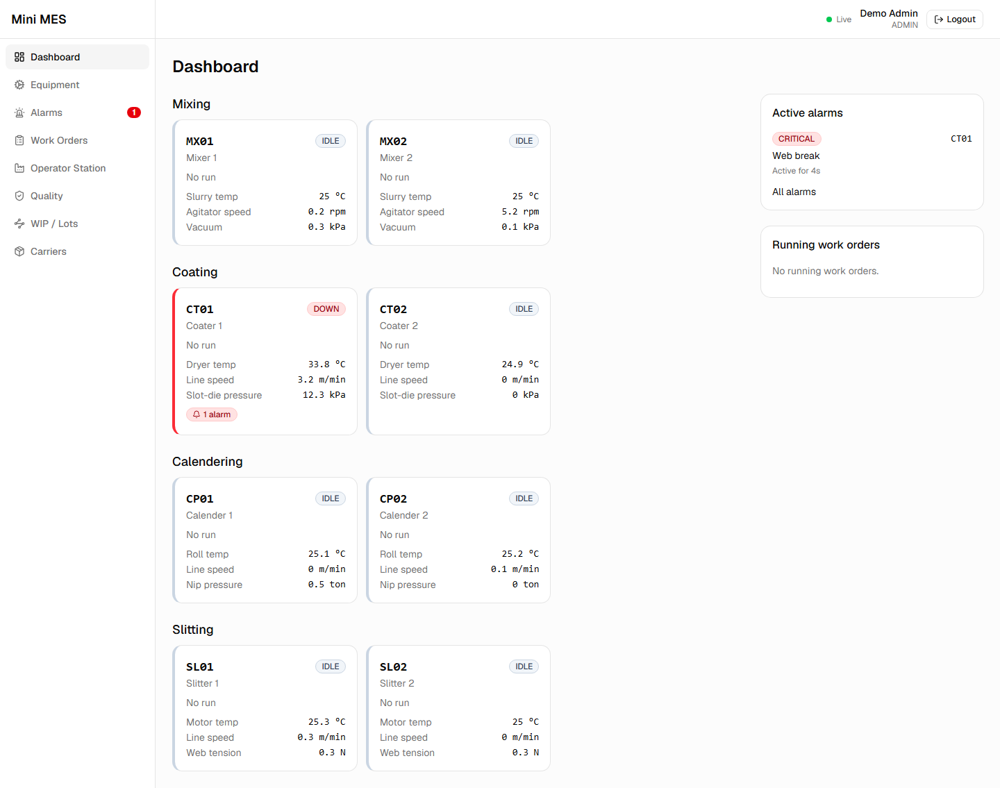<br>An injected fault: a critical "Web break" alarm takes CT01 DOWN.</td>
    <td width="50%">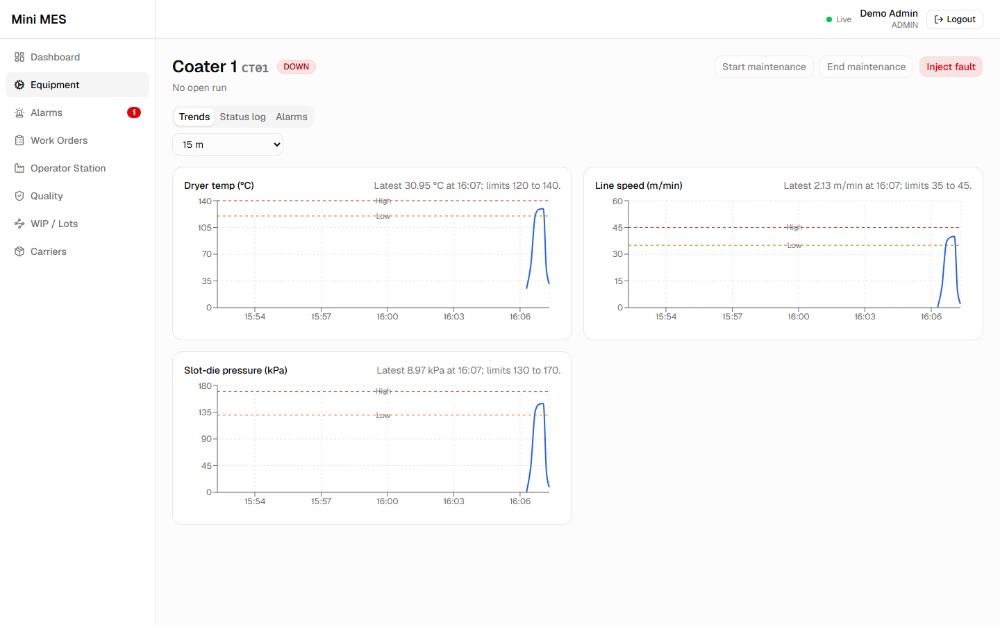<br>CT01 trends over the 15-minute range: the coating run settles inside its limit lines, then the readings fall back toward rest.</td>
  </tr>
</table>

## What it does

Four roles share the app: Planner, Operator, QC and Admin. Admin can do everything the other three can, plus machine maintenance and fault injection.

**Work Orders.** A planner creates a work order for a product (`CATH-NCM811` or `ANOD-GRAPHITE`) with a target number of pancakes and a planned start and end, and assigns a machine to each route step. Each step must get exactly one machine, and that machine must run that operation: a coater cannot be assigned to slitting (`WO_INVALID_ASSIGNMENT`). The order can be edited only while it is PLANNED and accepts track-in only while it is RELEASED or RUNNING (`WO_NOT_ACTIVE`). It completes by itself when its count of finished good pancakes reaches the target, or when a planner completes a running order by hand.

**Production Execution.** On the Operator Station the operator picks a machine and one of the work orders assigned to it, scans the input lots, tracks in, records the output and tracks out with the consumed quantities. Each operation accepts only its own set of inputs: MIX takes one or more RAW lots, COAT exactly one FOIL lot and one SLURRY lot, CAL and SLIT one ELECTRODE roll (`INVALID_INPUT_SET`). Every input must have the product's polarity, so a cathode slurry cannot be coated onto copper foil (`POLARITY_MISMATCH`). A lot must also be due for that operation on its route (`ROUTE_VIOLATION`), and an intermediate lot cannot move to another work order (`LOT_WO_MISMATCH`). A machine runs one run at a time and only while IDLE (`EQUIPMENT_NOT_AVAILABLE`). Slitting records one line per lane and always uses up the whole electrode roll.

**Lots & Genealogy.** Every material and intermediate product is a lot with a readable ID. Every output records a genealogy link to each lot it was made from, and the lot page draws the backward or forward graph. Calendering keeps the roll's lot ID, because the roll is pressed, not turned into new material. A track-out cannot consume more than a lot holds (`QTY_EXCEEDS_LOT`). A lot used up in full becomes CONSUMED. A lot only partly used goes back to WAIT holding what is left. Each change writes a lot event, and the history built from those events cannot be edited afterwards.

**Carriers.** The line has 40 bobbins (`BB-0001` to `BB-0040`) for electrode rolls and 200 pancake cores (`PC-0001` to `PC-0200`) for pancakes. A carrier holds one lot at a time (`CARRIER_NOT_EMPTY`), and only the lot type it is made for: a pancake cannot go on a bobbin (`CARRIER_TYPE_MISMATCH`). Operators can scan the carrier code instead of the lot ID. The carrier is freed when its lot is used up or scrapped.

**Quality.** Each product has inspection specs per operation with inclusive lower and upper limits (for the cathode: Viscosity and Solid content after MIX, Loading weight after COAT, Thickness and Density after CAL, Width and Burr height after SLIT). A lot produced by an operation that has a spec cannot be tracked into the next step until it passes (`LOT_QUALITY_PENDING`). A failed inspection needs a defect code for that operation and a reason (`DEFECT_REQUIRED`), and a lot that failed inspection is held until QC releases or scraps it. Releasing it turns its quality to PASS. A final pancake that passes, or is released, is FINISHED and counted on its work order. QC can also hold a waiting lot by hand, with a reason. The inspection form accepts a decimal comma (`70,5`).

**Equipment & Simulator.** Eight machines: mixers `MX01`/`MX02`, coaters `CT01`/`CT02`, calenders `CP01`/`CP02` and slitters `SL01`/`SL02` (8 lanes each). Each operation has three parameters with a setpoint and limits, for example the coater's Dryer temp at 130 °C with limits 120 to 140 °C. A separate simulator service sends a reading for every parameter every 2 seconds. While a machine is RUNNING its readings move toward their setpoints, and otherwise they move toward rest. Now and then a running machine's parameter drifts past a limit and raises that parameter's alarm, which clears once the value is back inside its limits. A parameter still ramping up after track-in does not raise alarms until it has first come inside its limits. An Admin can start and end maintenance, which is allowed only on an IDLE machine with no open run, and can inject a fault.

**Alarms.** There are 12 alarm codes, three per operation, at severity WARNING, MAJOR or CRITICAL. A CRITICAL alarm takes the machine DOWN and keeps its open run. The machine goes back to RUNNING or IDLE only when its last active critical alarm clears. A machine has at most one active alarm per code. An operator acknowledges an alarm once (`ALARM_ALREADY_ACKNOWLEDGED`). Active alarms appear on the dashboard, the operator station and a badge in the navigation, and a new CRITICAL alarm also pops up as a toast.

## Process and lot model

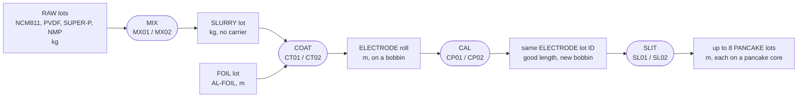

The anode product runs the same route with GRAPHITE, CMC and SBR as raw materials and copper foil (`CU-FOIL`).

### Lot IDs

IDs are dated with the plant's calendar date (time zone `Asia/Jakarta` by default, set with `PLANT_TIME_ZONE`). Sequence numbers restart every day for each prefix and are issued inside the command's transaction, so a rolled-back command does not use up a number. `C`/`A` is the polarity: cathode or anode.

| ID | Format | Example |
| --- | --- | --- |
| Work order | `WO-yyMMdd-nnn` | `WO-261003-001` |
| RAW material | `R{C\|A}-yyMMdd-nnn` | `RC-261003-005` |
| FOIL | `F{C\|A}-yyMMdd-nnn` | `FC-261003-002` |
| SLURRY | `S{C\|A}-yyMMdd-{mixer}-nn` | `SC-261003-MX01-01` |
| ELECTRODE | `E{C\|A}-yyMMdd-{coater}-nnn` | `EC-261003-CT01-001` |
| PANCAKE | `{electrode lot}-{lane, 2 digits}` | `EC-261003-CT01-001-01` |

### Example genealogy

The chain behind one pancake from the demo script, run on a fresh database on 3 October 2026:

```text
EC-261003-CT01-001-01          PANCAKE, lane 1, 120 m on PC-0001
└─ EC-261003-CT01-001          ELECTRODE, coated on CT01, then calendered on CP01 (same lot ID)
   ├─ FC-261003-002            FOIL, AL-FOIL, 1020 m of 1500 m used
   └─ SC-261003-MX01-01        SLURRY, 480 kg, mixed on MX01
      ├─ RC-261003-005         RAW, NCM811 300 kg
      ├─ RC-261003-006         RAW, PVDF 15 kg
      ├─ RC-261003-007         RAW, SUPER-P 15 kg
      └─ RC-261003-008         RAW, NMP 170 kg
```

The forward view of `FC-261003-002` shows the reverse: the foil lot, its electrode roll and both pancakes cut from it.

## State machines

Work order:

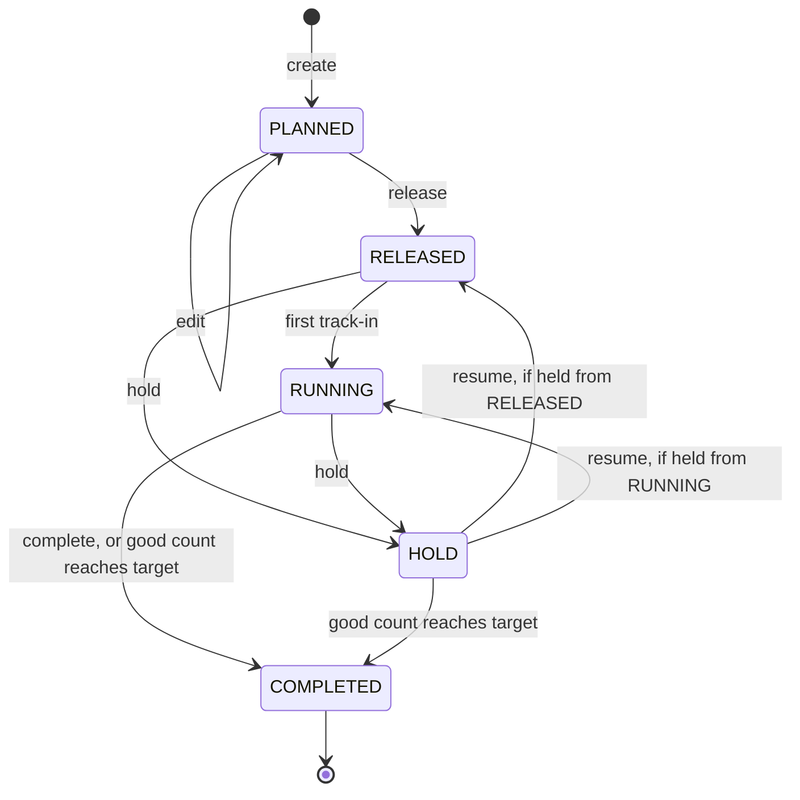

Equipment:

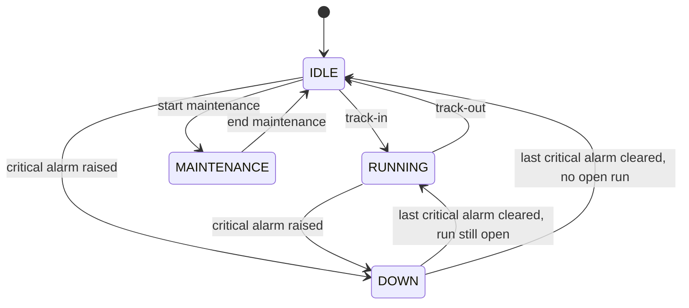

A track-out while the machine is DOWN closes the run but leaves the machine DOWN.

Lot status and quality (`status / quality`):

| From | Action | To |
| --- | --- | --- |
| (new) | Register material | `WAIT / PASS` |
| (new) | Produced by MIX, COAT or SLIT | `WAIT / NONE` |
| `WAIT` | Track-in | `RUN` |
| `RUN` | Track-out, consumed in full | `CONSUMED` |
| `RUN` | Track-out, partly consumed | `WAIT` with the rest |
| `RUN` | Calendering output | `WAIT / NONE` (inspected again after CAL) |
| `WAIT / NONE` | Inspection passes | `WAIT / PASS` (a final pancake becomes `FINISHED`) |
| `WAIT / NONE` | Inspection fails | `HOLD / FAIL` |
| `WAIT` | Manual hold by QC | `HOLD` |
| `HOLD` | Release | `WAIT`, `FAIL` becomes `PASS` (a final pancake becomes `FINISHED`) |
| `HOLD` | Scrap | `SCRAPPED`, carrier freed |

## Architecture

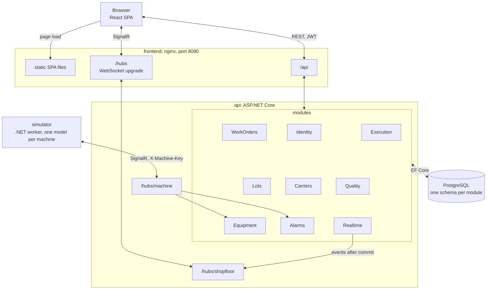

The API is one deployable. Each module has its own folder under `Modules/`, usually split into `Domain`, `Data` and `Features`, and Realtime lives in `Shared/Realtime`. Each module keeps its tables in its own PostgreSQL schema: `identity`, `wo`, `exec`, `lot`, `carrier`, `qc`, `eqp` and `alarm`. Realtime has no tables. Docker Compose runs four containers: `postgres`, `api`, `simulator` and `frontend`. Only the frontend (port 8080) and PostgreSQL (port 5432) are published to the host. The simulator connects to the API's machine hub over the Compose network.

### Design decisions

- **Modular monolith, one transaction per command.** Each command handler runs inside `ExecuteInTransactionAsync`: a track-in that moves lots, starts a run and changes the machine and the work order commits or rolls back as a whole, without a message bus between modules.
- **Business rules live in the entities and return stable error codes.** Methods such as `Lot.Consume` or `WorkOrder.Release` return a `Result` with a code like `ROUTE_VIOLATION`. The API maps it to an RFC 7807 ProblemDetails response (422 for a broken rule, 404 or 409 otherwise) carrying `errorCode`, and the frontend shows the message.
- **Optimistic concurrency on `xmin`, plus a row lock on production runs.** Lots, work orders, equipment, carriers and alarms use PostgreSQL's `xmin` as their row version, and a conflicting write returns 409 `CONCURRENCY_CONFLICT`. Commands on a production run first take `SELECT ... FOR UPDATE` on the run row, so two produce or track-out requests on the same run run one after the other instead of both passing their checks.
- **`lot_event` is append-only, enforced by the database.** A trigger raises an error on any `UPDATE` or `DELETE` of `lot.lot_event`, so the lot history cannot be rewritten, even by code that bypasses the API.
- **Inspection measurements snapshot their limits.** Each measurement copies the item name, unit, LSL and USL from the spec when it is recorded, so changing a spec later does not change past results.
- **Real-time events are published only after commit, derived from tracked changes.** Before saving, the DbContext reads the change tracker for added or modified lots, work orders, equipment and alarms. It publishes those changes to `/hubs/shopfloor` after the commit, so a rolled-back command sends nothing and handlers never publish by hand. The browser uses each event to refresh the matching TanStack Query cache.
- **Machines authenticate with an API key, separately from users.** The simulator sends an `X-Machine-Key` header, compared in constant time, and gets a `Machine` role that only `/hubs/machine` accepts. Users log in with JWT bearer tokens and cannot call the machine hub.
- **The simulator logic is a pure, unit-tested model.** `MachineModel` takes time and randomness from its caller and does no I/O. That makes ramp-up, drift, alarm raise and clear, and fault injection testable step by step. The SignalR session and worker around it are thin.
- **Parameter storage is throttled and has a retention limit.** Every reading is pushed live and kept in memory as the latest value. Each parameter is stored at most once every 10 seconds, and a background service deletes stored readings older than 7 days, once an hour.

## Tech stack

| Layer | Technology |
| --- | --- |
| API | .NET 10, ASP.NET Core 10 minimal APIs, SignalR, JWT bearer authentication |
| Data access | Entity Framework Core 10, Npgsql EF Core provider 10, EFCore.NamingConventions 10 (snake_case) |
| Database | PostgreSQL 18 |
| Simulator | .NET 10 worker service, SignalR client 10 |
| Frontend | React 19, TypeScript 6, Vite 8, React Router 7, TanStack Query 5, React Hook Form 7, Zod 4 |
| UI | Tailwind CSS 4, shadcn/ui on Radix UI, Recharts 3 (trends), React Flow 12 (`@xyflow/react`, genealogy), sonner (toasts), lucide-react |
| Realtime client | `@microsoft/signalr` 10 |
| Backend tests | xUnit v3, Testcontainers for .NET 4 (PostgreSQL), `Microsoft.AspNetCore.Mvc.Testing` |
| Frontend tests | Vitest 5, Testing Library, jsdom, Playwright 1 (end-to-end) |
| Lint | oxlint |
| Runtime | Docker Compose, nginx, GitHub Actions CI |

## Run it

Prerequisites: [Docker](https://www.docker.com/) (Docker Desktop, or Docker Engine with Compose) is all you need to run the stack. To run the tests and the end-to-end test you also need:

- the [.NET 10 SDK](https://dotnet.microsoft.com/download/dotnet/10.0), 10.0.400 or later (pinned in `global.json`),
- [Node.js](https://nodejs.org/) 24.15 or later (22.22.2 or later also works; the frontend's test dependencies need one of these, and CI uses Node 24),
- Docker running, because the integration tests start PostgreSQL through Testcontainers and the end-to-end test runs against the Compose stack.

```bash
docker compose up --build
```

Open <http://localhost:8080>. The first start builds the images, applies the database migrations and seeds the demo data: users, products, materials with one received lot each, the eight machines, carriers, specs, defect codes and alarm codes.

If host port 5432 is already taken, map PostgreSQL to another port:

```bash
POSTGRES_PORT=55432 docker compose up --build
```

```powershell
$env:POSTGRES_PORT=55432; docker compose up --build
```

The `simulator` service starts with the stack and feeds live readings and alarms to the API. It authenticates with a shared machine key. The default is a demo value; to use your own for both the API and the simulator, set `MACHINE_API_KEY` (at least 16 characters):

```bash
MACHINE_API_KEY=my-own-machine-key-123 docker compose up --build
```

```powershell
$env:MACHINE_API_KEY="my-own-machine-key-123"; docker compose up --build
```

To run the simulator outside Docker against an API started with `dotnet run --project backend/src/MiniMes.Api`, use `dotnet run --project backend/src/MiniMes.Simulator`. Its launch profile sets `DOTNET_ENVIRONMENT=Development`, which loads `appsettings.Development.json`: the hub on `localhost:5080` and the same development key as the API's Development settings.

### Demo users

The login page has a "Log in as" card for each user: one click, no password. To log in with a password, use the default demo password `demo-pass`. Set `DEMO_PASSWORD` before the first start to change it (`DEMO_PASSWORD=... docker compose up --build`, or `$env:DEMO_PASSWORD="..."; docker compose up --build` in PowerShell).

| User       | Role     |
| ---------- | -------- |
| `planner`  | Planner  |
| `operator` | Operator |
| `qc`       | QC       |
| `admin`    | Admin    |

Stop with `docker compose down`. To reset to a freshly seeded database, drop the volume as well:

```bash
docker compose down -v
```

## Demo script (about 10 minutes)

Clicking through it by hand takes about ten minutes, most of it in step 7. The same steps, in the same order and with the same values, run as an automated end-to-end test, which also takes the screenshots above. Your work order and lot numbers will differ from the ones shown here.

1. **Planner: the dashboard.** On the login page click **Log in as Planner**. The dashboard shows the eight machines grouped by operation, each with its status and live readings, and **Live** in the header. Notice the readings change every couple of seconds without a reload.
2. **Planner: create and release a work order.** Open **Work Orders** → **New Work Order**. Product `CATH-NCM811`, Target quantity `2`, Planned start now, Planned end 24 hours later, Mixing `MX01`, Coating `CT01`, Calendering `CP01`, Slitting `SL01` → **Save**, then **Release**. Notice the order is now RELEASED with progress 0 / 2, and **Release** has been replaced by **Hold**.
3. **Planner: receive material.** Open **WIP / Lots** → **Register material** and register five lots, one at a time: `NCM811` 300 kg, `PVDF` 15 kg, `SUPER-P` 15 kg, `NMP` 170 kg and `AL-FOIL` 1500 m. Notice each one gets a dated ID (`RC-…`, `FC-…`) and starts as WAIT / PASS, due for MIX or COAT.
4. **Operator: mix the slurry.** **Logout**, then **Log in as Operator**, which opens the Operator Station. Pick **MX01** and select the work order. In **Scan lot or carrier**, type each of the four RAW lot IDs and press Enter after each one → **Track in**. Enter Good (kg) `480`, Reject (kg) `20` → **Produce** → **Track out** → **Confirm track out** (the defaults use the raw lots in full). Notice the four RAW lots are now CONSUMED and a slurry lot `SC-…-MX01-…` exists. Had the foil been among the scanned lots, **Track in** would have been refused with `INVALID_INPUT_SET`, because MIX only accepts RAW lots.
5. **QC: inspect the slurry.** **Logout**, then **Log in as QC**, which opens Quality on the **Inspection queue**. Click **Inspect** on the slurry. Enter Viscosity `6000` and Solid content `70,5`, with a decimal comma. Notice each value is judged OK as you type and the result shows PASS. → **Submit inspection**. A toast confirms `<slurry> PASS`, and the slurry disappears from the queue, so the coater now accepts it. Before this inspection, the coater refuses it with `LOT_QUALITY_PENDING`.
6. **Operator: coat.** **Logout**, then **Log in as Operator** again, pick **CT01** and select the work order. Scan the foil lot, then the slurry lot → **Track in**. Notice CT01 turns RUNNING and its three live parameters (Dryer temp, Line speed, Slot-die pressure) ramp up from rest toward their setpoints. Enter Empty carrier: the first empty bobbin (`BB-0001` on a fresh database), Good (m) `1000`, Reject (m) `20` → **Doff roll**. Notice the roll `EC-…-CT01-…` is now on that bobbin. Wait until the three parameters are inside their limits, and keep the run open for about half a minute more: readings are stored every 10 seconds, so the trends in step 10 then show the run inside its limits. **Track out**, set the foil's consumed quantity to `1020` (the slurry's 480 kg stays as it is) → **Confirm track out**. Notice the foil goes back to WAIT with 480 m left, and the slurry is CONSUMED.
7. **The rest of the line, and a quality failure.**
   - As QC, inspect the roll from the queue: Loading weight `20` → PASS.
   - As Operator on **CP01**, select the work order, scan the bobbin code (or the roll ID) → **Track in**, then Empty carrier: the next empty bobbin, Good (m) `990`, Reject (m) `10` → **Produce** → **Track out** → **Confirm track out**. Notice the roll keeps its lot ID and moves to the new bobbin, and the old bobbin is free again.
   - As QC, inspect the calendered roll: Thickness `120`, Density `3.45` → PASS.
   - As Operator on **SL01**, select the work order, scan the roll → **Track in**. In the lane grid, give lanes 1 and 2 one empty pancake core each (`PC-…`), Good m `120` and Reject m `0`. SL01 slits the roll into eight lanes at once; the order needs two pancakes, so wind lanes 1 and 2 onto cores and scrap lanes 3 to 8 (Reject m `120`, no core) → **Produce** → **Track out** → **Confirm track out**. Notice two pancake lots `<roll>-01` and `<roll>-02` appear, and the whole roll is consumed.
   - As QC, inspect pancake `-01` with Width `100` and Burr height `4` → PASS. Notice the work order's progress is now 1 / 2.
   - Inspect pancake `-02` with Width `100` and Burr height `10`. The limit is 8 µm, so the result turns FAIL. Pick Defect code `SL-BURR`, enter Reason `Burr height above the upper limit` → **Submit inspection**. Notice the toast says the lot is on hold.
   - Open **Quality** → **On hold** and click **Disposition** on pancake `-02`. Choose **Release**, Reason `Burr re-measured within the customer tolerance` → **Release lot**. A toast confirms `<pancake> released`.
   - Open **Work Orders** and the order. Notice it is COMPLETED at 2 / 2: the released pancake was finished and counted.
8. **Trace a pancake back to its materials.** On the work order page click pancake `-01`, open the **Genealogy** tab and choose **Backward**. Notice the graph of 8 lots: pancake ← electrode roll ← the AL-FOIL lot and the slurry ← the four RAW lots. Its **History** tab lists every event of the lot, and its **Quality** tab lists its inspections.
9. **Admin: inject a fault.** **Logout**, then **Log in as Admin**, open **Equipment** → **CT01** → **Inject fault** → **Simulate fault**. A toast confirms "Fault requested on CT01", and the critical alarm follows as its own toast, "CT01: Web break". Open the **Dashboard**. Notice CT01 is DOWN, **Active alarms** lists the CRITICAL Web break on CT01, and the Alarms entry in the navigation shows a badge. The simulator clears the fault by itself after 30 to 60 seconds, and CT01 returns to IDLE.
10. **Admin: parameter trends.** **Equipment** → **CT01** → **Trends** tab, Range `15 m`. Notice the three charts span the last 15 minutes, with their low and high limit lines, and show the coating run inside its limits.

To run the same script automatically against the running stack, install the frontend's packages and the browser once, then run the test:

```bash
npm ci --prefix frontend
npx --prefix frontend playwright install chromium
npm run e2e --prefix frontend
```

On a fresh Linux machine, use `npx --prefix frontend playwright install --with-deps chromium` to install the browser's system libraries as well.

It drives the UI for steps 1, 2, 4, 5, 6, the release in step 7 and steps 8 to 10. Material registration, the CAL and SLIT runs and the other inspections in step 7 go through the API, to save time. It creates its own work order and lots and picks carriers that are empty, so it can run again on the same database. It saves its screenshots under `frontend/test-results/screenshots/`, which git ignores. To rewrite the README images in `docs/screenshots/` instead, set `UPDATE_SCREENSHOTS=1`:

```bash
UPDATE_SCREENSHOTS=1 npm run e2e --prefix frontend
```

```powershell
$env:UPDATE_SCREENSHOTS=1; npm run e2e --prefix frontend
```

In PowerShell the variable stays set for the rest of the session; clear it with `Remove-Item Env:UPDATE_SCREENSHOTS`. To point the test at another address, set `E2E_BASE_URL` (`E2E_BASE_URL=http://localhost:8080 npm run e2e --prefix frontend`, or `$env:E2E_BASE_URL="http://localhost:8080"; npm run e2e --prefix frontend` in PowerShell).

## Tests

| Suite | Project | Tests | What it covers |
| --- | --- | ---: | --- |
| Backend unit | `backend/tests/MiniMes.UnitTests` | 160 | Entity rules and state transitions (work order, lot, carrier, equipment, alarm, production run, inspection, spec), operation input rules, lot ID format, error to ProblemDetails mapping, plant calendar, quantity limits |
| Backend integration | `backend/tests/MiniMes.IntegrationTests` | 259 | The real API host against PostgreSQL 18 started by Testcontainers: the endpoints and their error codes, a full MIX-to-SLIT flow, concurrent commands, the append-only trigger, lot ID sequences, genealogy queries, realtime events and both hubs, the simulator session against the machine hub |
| Simulator model | `backend/tests/MiniMes.Simulator.Tests` | 32 | `MachineModel`: values within limits while running and back to rest when idle, never a negative speed or pressure at rest, drift, alarm raise and clear, no alarms during the ramp after track-in, fault injection and auto-clear, retries of rejected raises and clears |
| Frontend | `frontend/src/**/*.test.ts(x)` | 121 | Vitest, Testing Library and jsdom: pages and forms, the operator station, slitting grid, inspection judging and decimal parsing, disposition, genealogy layout, trend time axis, realtime cache updates |
| End-to-end | `frontend/e2e/demo.spec.ts` | 1 | The demo script above, in Chromium against the running Compose stack |

Last full run: 451 backend tests (`dotnet test backend`), 121 frontend tests in 28 files, and the end-to-end test, all passing. The integration tests start PostgreSQL through Testcontainers, so Docker must be running.

```bash
dotnet test backend
npm ci --prefix frontend
npm test --prefix frontend -- --run
npm run e2e --prefix frontend
```

CI (`.github/workflows/ci.yml`) runs the backend tests, the frontend lint, tests and build, the README link check and `docker compose build` on every push and pull request. The end-to-end test needs the full stack running and is run locally.

## Project structure

```text
.
├── backend/
│   ├── src/
│   │   ├── MiniMes.Api/
│   │   │   ├── Modules/            one folder per module: Domain (entities, rules), Data (EF mappings), Features (endpoints, handlers)
│   │   │   ├── Shared/             transactions, migrations, demo seeder, ProblemDetails mapping, realtime change feed
│   │   │   └── Program.cs          module registration, hubs, startup migration and seeding
│   │   └── MiniMes.Simulator/      machine simulator worker: MachineModel, hub session
│   ├── tests/
│   │   ├── MiniMes.UnitTests/
│   │   ├── MiniMes.IntegrationTests/
│   │   └── MiniMes.Simulator.Tests/
│   └── MiniMes.slnx
├── frontend/
│   ├── src/
│   │   ├── features/               one folder per screen area: dashboard, work-orders, operator, quality, lots, equipment, alarms, carriers, auth
│   │   ├── shared/                 API client, auth, realtime provider, layout
│   │   └── components/ui/          shadcn/ui components
│   ├── e2e/                        Playwright demo walkthrough and its API helpers
│   └── nginx.conf                  static files, /api and /hubs proxy
├── docs/screenshots/               README screenshots, rewritten by the end-to-end test with UPDATE_SCREENSHOTS=1
├── scripts/check-readme-links.mjs  checks the README's relative links, with exact case
├── docker-compose.yml
└── .github/workflows/ci.yml
```

## What I would build next

- **Edge integration over OPC UA or MQTT**, replacing the simulator's SignalR connection with a gateway that reads real PLC tags.
- **TimescaleDB for parameter readings**, with hypertables and continuous aggregates instead of throttled rows and a purge job.
- **SPC charts on inspection data**: X-bar/R charts and Cpk per spec item, with run rules that warn before a lot fails.
- **OEE and shifts**: availability, performance and quality per machine and shift, from the status log, run times and good/reject counts.
- **Recipe and BOM validation for mixing**: check the scanned raw lots and their quantities against the product's recipe at track-in.
- **Cell assembly with serial numbers**: carry genealogy past the pancake into stacked or wound cells, each with its own serial number.

## License

[MIT](LICENSE)
