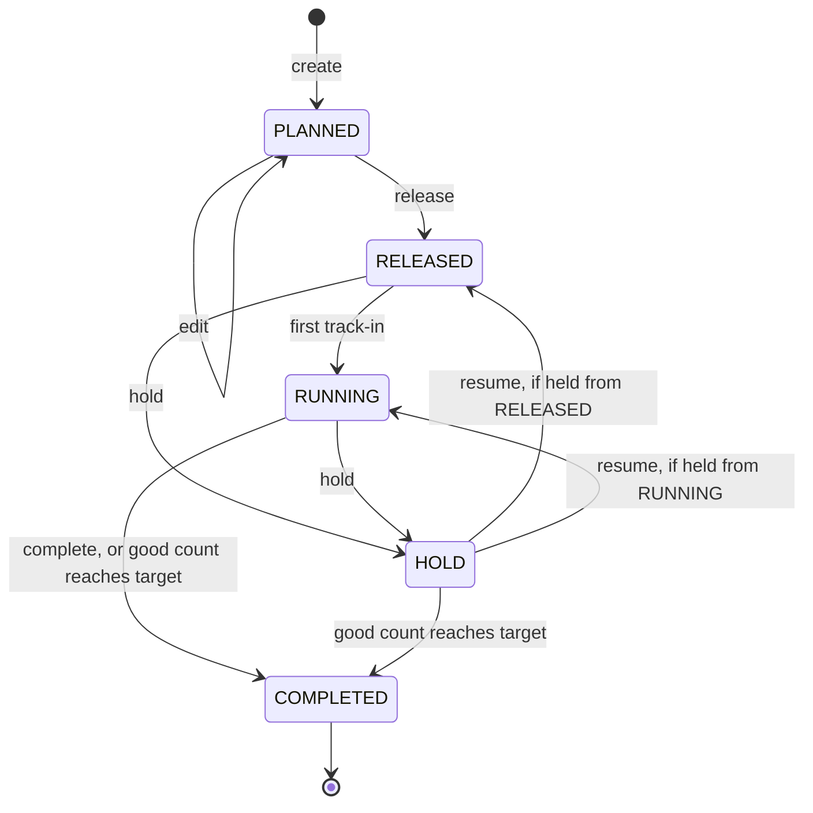
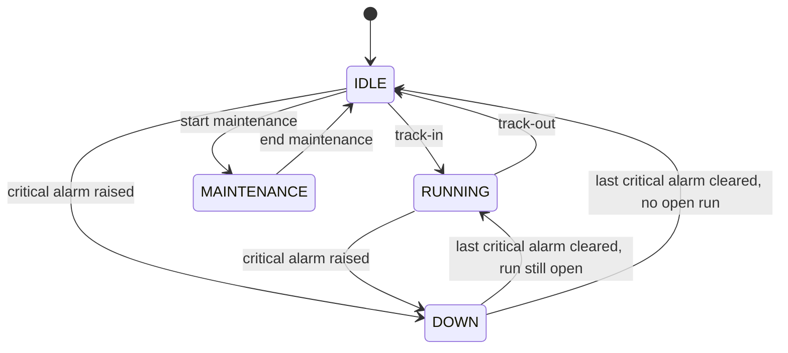

# MINI MES

> Manufacturing execution system for a lithium-ion battery electrode line, built to demonstrate work order execution, lot genealogy, quality gates and real-time shop floor monitoring.


---

## What It Does

Runs the four steps of electrode production, with a machine simulator feeding live readings and alarms:

```
Mixing → Coating → Calendering → Slitting
```

Four roles share the app: Planner (work orders and material), Operator (track-in, output, track-out), QC (inspections and lot disposition) and Admin (everything, plus maintenance and fault injection). Every lot is traceable back to its raw materials, and every rule violation returns a stable error code. The full stack runs locally in Docker with a single command.

---

## Screenshots


<table>
  <tr>
    <td width="50%"><br>A released work order, with one machine assigned to each route step.</td>
    <td width="50%"><br>Operator station on coater CT01: open run, input lots, doffed roll, live parameters.</td>
  </tr>
  <tr>
    <td width="50%"><br>Slurry inspection. Each value is judged against its limits as it is typed.</td>
    <td width="50%"><br>Backward genealogy of a pancake, down to the foil, slurry and raw material lots.</td>
  </tr>
  <tr>
    <td width="50%"><br>An injected fault: a critical "Web break" alarm takes CT01 DOWN.</td>
    <td width="50%"><br>CT01 parameter trends against their limit lines.</td>
  </tr>
</table>

---

## Architecture

```
┌─────────────────┐
│  Browser        │  React SPA, TanStack Query cache
└───┬─────────┬───┘
    │ REST+JWT│ SignalR
┌───▼─────────▼───┐
│  nginx :8080    │  static SPA, /api and /hubs (WebSocket) proxy
└────────┬────────┘
         │
┌────────▼─────────────────────────────────────────────────┐
│  ASP.NET Core API (modular monolith)                     │
│  Identity · WorkOrders · Execution · Lots · Carriers     │
│  Quality · Equipment · Alarms · Realtime                 │
│  • one transaction per command                           │
│  • events published to /hubs/shopfloor after commit      │
│  • /hubs/machine accepts the simulator only              │
└───┬──────────────────────────────────────────────▲───────┘
    │ EF Core                                      │ SignalR, X-Machine-Key
    ▼                                              │
PostgreSQL 18                              ┌────────┴────────┐
• one schema per module                    │  Simulator      │
• xmin optimistic concurrency              │  .NET worker    │
• append-only lot_event                    │  8 machines,    │
                                           │  reading / 2 s  │
                                           └─────────────────┘
```

---

## Tech Stack

| Layer           | Technology                                                         | Purpose                                                  |
| --------------- | ------------------------------------------------------------------ | -------------------------------------------------------- |
| API             | .NET 10, ASP.NET Core 10 minimal APIs, JWT bearer                  | REST endpoints, role-based access                        |
| Realtime        | SignalR, `@microsoft/signalr` 10                                   | Shop floor events to the browser, machine link           |
| Data            | EF Core 10, Npgsql, EFCore.NamingConventions, PostgreSQL 18        | Per-module schemas, snake_case tables, migrations        |
| Simulator       | .NET 10 worker service                                             | Readings, drift, alarms and faults for 8 machines        |
| Frontend        | React 19, TypeScript 6, Vite 8, React Router 7                     | Role-based screens                                       |
| Frontend state  | TanStack Query 5, React Hook Form 7, Zod 4                         | Server cache refreshed by events, forms, validation      |
| UI              | Tailwind CSS 4, shadcn/ui, Recharts 3, React Flow 12, sonner       | Components, trend charts, genealogy graph, toasts        |
| Infra           | Docker Compose, nginx, GitHub Actions                              | 4-service local stack, one command, CI                   |
| Testing         | xUnit v3, Testcontainers, Vitest 5, Testing Library, Playwright 1  | Unit, integration, component and end-to-end tests        |
| Lint            | oxlint                                                             | Frontend linting                                         |

---

## Equipment Fleet

Seeded on first start. Each operation has three parameters with a setpoint and limits; the simulator sends a reading for each every 2 seconds.

| ID          | Equipment | Operation | Parameters (setpoint, unit)                                          |
| ----------- | --------- | --------- | -------------------------------------------------------------------- |
| MX01/MX02   | Mixer     | MIX       | Slurry temp (25 °C), Agitator speed (1500 rpm), Vacuum (85 kPa)      |
| CT01/CT02   | Coater    | COAT      | Dryer temp (130 °C), Line speed (40 m/min), Slot-die pressure (150 kPa) |
| CP01/CP02   | Calender  | CAL       | Roll temp (90 °C), Line speed (30 m/min), Nip pressure (300 ton)     |
| SL01/SL02   | Slitter   | SLIT      | Motor temp (45 °C), Line speed (80 m/min), Web tension (120 N); 8 lanes each |

There are 12 alarm codes, three per operation, at WARNING, MAJOR or CRITICAL severity. A CRITICAL alarm takes the machine DOWN.

---

## Process and Lot Model


The anode (`ANOD-GRAPHITE`) runs the same route with GRAPHITE, CMC and SBR as raw materials and copper foil (`CU-FOIL`). The cathode product is `CATH-NCM811`.

### Lot IDs

IDs carry the plant's calendar date (`Asia/Jakarta` by default, set with `PLANT_TIME_ZONE`). Sequences restart daily per prefix and are issued inside the command's transaction, so a rolled-back command does not burn a number. `C`/`A` is cathode or anode.

| ID           | Format                             | Example                  |
| ------------ | ---------------------------------- | ------------------------ |
| Work order   | `WO-yyMMdd-nnn`                    | `WO-261003-001`          |
| RAW material | `R{C\|A}-yyMMdd-nnn`               | `RC-261003-005`          |
| FOIL         | `F{C\|A}-yyMMdd-nnn`               | `FC-261003-002`          |
| SLURRY       | `S{C\|A}-yyMMdd-{mixer}-nn`        | `SC-261003-MX01-01`      |
| ELECTRODE    | `E{C\|A}-yyMMdd-{coater}-nnn`      | `EC-261003-CT01-001`     |
| PANCAKE      | `{electrode lot}-{lane, 2 digits}` | `EC-261003-CT01-001-01`  |

Carriers: 40 bobbins (`BB-0001`…`BB-0040`) for electrode rolls and 200 pancake cores (`PC-0001`…`PC-0200`) for pancakes. Operators can scan a carrier code instead of the lot ID.

### Example Genealogy

The chain behind one pancake from the demo walkthrough:

```
EC-261003-CT01-001-01          PANCAKE, lane 1, 120 m on PC-0001
└─ EC-261003-CT01-001          ELECTRODE, coated on CT01, then calendered on CP01 (same lot ID)
   ├─ FC-261003-002            FOIL, AL-FOIL, 1020 m of 1500 m used
   └─ SC-261003-MX01-01        SLURRY, 480 kg, mixed on MX01
      ├─ RC-261003-005         RAW, NCM811 300 kg
      ├─ RC-261003-006         RAW, PVDF 15 kg
      ├─ RC-261003-007         RAW, SUPER-P 15 kg
      └─ RC-261003-008         RAW, NMP 170 kg
```

---

## Business Rules

Violations return a ProblemDetails response with the `errorCode` below.

| Area       | Rule                                                                                                          | Error code                    |
| ---------- | ------------------------------------------------------------------------------------------------------------- | ----------------------------- |
| Work order | Each route step gets exactly one machine that runs that operation                                             | `WO_INVALID_ASSIGNMENT`       |
| Work order | Editable only while PLANNED; track-in only while RELEASED or RUNNING                                          | `WO_NOT_ACTIVE`               |
| Execution  | MIX takes RAW lots, COAT one FOIL and one SLURRY, CAL and SLIT one ELECTRODE roll                             | `INVALID_INPUT_SET`           |
| Execution  | Inputs must match the product's polarity                                                                      | `POLARITY_MISMATCH`           |
| Execution  | A lot must be due for that operation on its route                                                             | `ROUTE_VIOLATION`             |
| Execution  | An intermediate lot cannot move to another work order                                                         | `LOT_WO_MISMATCH`             |
| Execution  | A machine runs one run at a time, only while IDLE                                                             | `EQUIPMENT_NOT_AVAILABLE`     |
| Lots       | A track-out cannot consume more than the lot holds                                                            | `QTY_EXCEEDS_LOT`             |
| Carriers   | A carrier holds one lot, of the type it is made for                                                           | `CARRIER_NOT_EMPTY`, `CARRIER_TYPE_MISMATCH` |
| Quality    | A lot with an inspection spec cannot go to the next step until it passes                                      | `LOT_QUALITY_PENDING`         |
| Quality    | A failed inspection needs a defect code for that operation and a reason                                       | `DEFECT_REQUIRED`             |
| Alarms     | An alarm is acknowledged once                                                                                 | `ALARM_ALREADY_ACKNOWLEDGED`  |
| Any        | Conflicting concurrent write                                                                                  | `CONCURRENCY_CONFLICT` (409)  |

Other behavior:

- A work order completes when its good pancake count reaches the target, or when a planner completes it by hand.
- A fully consumed lot becomes CONSUMED. A partly consumed lot returns to WAIT with the remainder. Calendering keeps the roll's lot ID and moves it to a new bobbin. Slitting records one line per lane and consumes the whole roll.
- A failed lot goes on HOLD until QC releases or scraps it. A final pancake that passes, or is released, becomes FINISHED and counts toward its work order. The inspection form accepts a decimal comma (`70,5`).
- A parameter that drifts past a limit raises its alarm, which clears once the value is back inside. A parameter still ramping up after track-in raises no alarm until it has first been inside its limits.
- A CRITICAL alarm takes the machine DOWN and keeps its open run. The machine returns to RUNNING or IDLE when its last critical alarm clears. A machine has at most one active alarm per code.
- Maintenance is allowed only on an IDLE machine with no open run.

### State Machines

Work order:



Equipment (a track-out while DOWN closes the run but leaves the machine DOWN):



Lot status and quality (`status / quality`):

| From          | Action                         | To                                                                  |
| ------------- | ------------------------------ | ------------------------------------------------------------------- |
| (new)         | Register material              | `WAIT / PASS`                                                       |
| (new)         | Produced by MIX, COAT or SLIT  | `WAIT / NONE`                                                       |
| `WAIT`        | Track-in                       | `RUN`                                                               |
| `RUN`         | Track-out, consumed in full    | `CONSUMED`                                                          |
| `RUN`         | Track-out, partly consumed     | `WAIT` with the rest                                                |
| `RUN`         | Calendering output             | `WAIT / NONE` (inspected again after CAL)                           |
| `WAIT / NONE` | Inspection passes              | `WAIT / PASS` (a final pancake becomes `FINISHED`)                  |
| `WAIT / NONE` | Inspection fails               | `HOLD / FAIL`                                                       |
| `WAIT`        | Manual hold by QC              | `HOLD`                                                              |
| `HOLD`        | Release                        | `WAIT`, `FAIL` becomes `PASS` (a final pancake becomes `FINISHED`)  |
| `HOLD`        | Scrap                          | `SCRAPPED`, carrier freed                                           |

---

## Quick Start

**Prerequisites:** Docker Desktop (or Docker Engine with Compose) only. No .NET or Node needed to run the stack.

```bash
# 1. Clone
git clone <repo-url>
cd mini_mes

# 2. Start the full stack (defaults work as-is)
docker compose up --build
```

First run builds the images, applies migrations and seeds users, products, one received lot per material, the eight machines, carriers, specs, defect codes and alarm codes.

| URL                   | What                                  |
| --------------------- | ------------------------------------- |
| http://localhost:8080 | React app, with the API under `/api`  |
| localhost:5432        | PostgreSQL                            |

```bash
# Verify all 4 services are running
docker compose ps

# Tear down (keeps data)
docker compose down

# Full reset (wipes volumes, reseeds on next start)
docker compose down -v
```

### Demo Users

The login page has a "Log in as" card per user, no password needed. To log in with a password, use `demo-pass`.

| User       | Role     |
| ---------- | -------- |
| `planner`  | Planner  |
| `operator` | Operator |
| `qc`       | QC       |
| `admin`    | Admin    |

### Configuration

Set as environment variables before `docker compose up --build`:

| Variable          | Default       | Purpose                                                                  |
| ----------------- | ------------- | ------------------------------------------------------------------------ |
| `POSTGRES_PORT`   | `5432`        | Host port for PostgreSQL, if 5432 is taken                               |
| `MACHINE_API_KEY` | demo value    | Key shared by the API and simulator, at least 16 characters              |
| `DEMO_PASSWORD`   | `demo-pass`   | Demo user password; applies on the first start only                      |
| `PLANT_TIME_ZONE` | `Asia/Jakarta`| Time zone for the date in lot IDs                                        |

```bash
POSTGRES_PORT=55432 docker compose up --build
```

```powershell
$env:POSTGRES_PORT=55432; docker compose up --build
```

To run the simulator outside Docker against an API started with `dotnet run --project backend/src/MiniMes.Api`, use `dotnet run --project backend/src/MiniMes.Simulator`. Its launch profile loads `appsettings.Development.json`: the hub on `localhost:5080` and the API's development key.

---

## Demo Walkthrough

About 10 minutes by hand. The same steps, with the same values, run as an automated end-to-end test that also takes the screenshots above. Your work order and lot numbers will differ from the ones shown.

1. **Planner: dashboard.** Click **Log in as Planner**. Eight machines grouped by operation, with readings updating every couple of seconds.
2. **Planner: work order.** **Work Orders** → **New Work Order**: product `CATH-NCM811`, target `2`, planned start now and end in 24 hours, `MX01`, `CT01`, `CP01`, `SL01` → **Save** → **Release**.
3. **Planner: material.** **WIP / Lots** → **Register material**: `NCM811` 300 kg, `PVDF` 15 kg, `SUPER-P` 15 kg, `NMP` 170 kg, `AL-FOIL` 1500 m. Each starts as WAIT / PASS.
4. **Operator: mix.** Log in as Operator, pick **MX01** and the work order. In **Scan lot or carrier**, enter the four RAW lot IDs → **Track in**. Good `480` kg, Reject `20` kg → **Produce** → **Track out** → **Confirm track out**. The RAW lots become CONSUMED and a slurry lot appears. Scanning the foil here would fail with `INVALID_INPUT_SET`.
5. **QC: inspect the slurry.** Log in as QC, **Inspect** the slurry: Viscosity `6000`, Solid content `70,5` → **Submit inspection**. Before this, the coater refuses the slurry with `LOT_QUALITY_PENDING`.
6. **Operator: coat.** On **CT01**, scan the foil and slurry → **Track in**. The three parameters ramp up from rest. Enter an empty bobbin, Good `1000` m, Reject `20` m → **Doff roll**. Once the parameters are inside their limits, keep the run open about 30 more seconds so the trends in step 10 show it (readings are stored every 10 seconds). **Track out** with the foil consumed quantity set to `1020`: the foil returns to WAIT with 480 m left.
7. **The rest of the line, and a quality failure.**
   - QC: roll, Loading weight `20` → PASS.
   - Operator on **CP01**: scan the bobbin, **Track in**, new empty bobbin, Good `990` m, Reject `10` m → **Produce** → **Track out**. The roll keeps its lot ID and moves to the new bobbin.
   - QC: calendered roll, Thickness `120`, Density `3.45` → PASS.
   - Operator on **SL01**: scan the roll, **Track in**. Give lanes 1 and 2 an empty pancake core each (Good `120` m) and scrap lanes 3 to 8 (Reject `120` m, no core) → **Produce** → **Track out**. Pancakes `<roll>-01` and `<roll>-02` appear and the roll is consumed.
   - QC: pancake `-01`, Width `100`, Burr height `4` → PASS (work order 1 / 2).
   - QC: pancake `-02`, Width `100`, Burr height `10` → FAIL (limit 8 µm). Defect code `SL-BURR`, any reason → **Submit inspection**; the lot goes on hold.
   - **Quality** → **On hold** → **Disposition** on `-02` → **Release** with a reason. The work order is now COMPLETED at 2 / 2.
8. **Trace a pancake.** From the work order, open pancake `-01` → **Genealogy** → **Backward**: 8 lots, from pancake to roll to foil, slurry and the four RAW lots. **History** lists every lot event, **Quality** its inspections.
9. **Admin: inject a fault.** Log in as Admin, **Equipment** → **CT01** → **Inject fault** → **Simulate fault**. A critical "Web break" alarm toast follows, the dashboard shows CT01 DOWN and the alarm badge appears. The simulator clears it after 30 to 60 seconds.
10. **Admin: trends.** **Equipment** → **CT01** → **Trends**, range `15 m`: three charts with limit lines, showing the coating run inside its limits.

To run the walkthrough automatically against the running stack (needs Node.js 24.15 or later; 22.22.2 or later also works):

```bash
npm ci --prefix frontend
npx --prefix frontend playwright install chromium
npm run e2e --prefix frontend
```

On a fresh Linux machine, install the browser with `npx --prefix frontend playwright install --with-deps chromium`.

The test drives the UI for steps 1, 2, 4, 5, 6, the release in step 7 and steps 8 to 10. Material registration, the CAL and SLIT runs and the other inspections go through the API to save time. It creates its own work order and lots and picks empty carriers, so it can run repeatedly on the same database. Screenshots go to `frontend/test-results/screenshots/` (git-ignored). Set `UPDATE_SCREENSHOTS=1` to rewrite the images in `docs/screenshots/` instead, and `E2E_BASE_URL` to target another address:

```bash
UPDATE_SCREENSHOTS=1 E2E_BASE_URL=http://localhost:8080 npm run e2e --prefix frontend
```

```powershell
$env:UPDATE_SCREENSHOTS=1; $env:E2E_BASE_URL="http://localhost:8080"; npm run e2e --prefix frontend
```

In PowerShell the variables persist for the session; clear them with `Remove-Item Env:UPDATE_SCREENSHOTS, Env:E2E_BASE_URL`.

---

## API

All endpoints except health and login need a JWT bearer token. Rule violations return RFC 7807 ProblemDetails with an `errorCode` (422 for a broken rule, 404 or 409 otherwise).

| Method        | Endpoint                                                      | Description                                              |
| ------------- | ------------------------------------------------------------- | -------------------------------------------------------- |
| `GET`         | `/api/health`                                                 | Database health check                                    |
| `POST`        | `/api/auth/login`, `/api/auth/demo-login`                     | Log in with a password, or as a demo user                |
| `GET`         | `/api/auth/me`                                                | Current user and role                                    |
| `GET`         | `/api/products`, `/api/materials`                             | Products and materials                                   |
| `GET` `POST`  | `/api/work-orders`                                            | List, create                                             |
| `GET` `PUT`   | `/api/work-orders/{id}`                                       | Detail, edit (PLANNED only)                              |
| `POST`        | `/api/work-orders/{id}/{release\|hold\|resume\|complete}`     | Status transitions                                       |
| `GET` `POST`  | `/api/lots`, `/api/lots/materials`                            | List lots, register material                             |
| `GET`         | `/api/lots/{lotId}`, `/events`, `/genealogy`                  | Lot detail, event history, backward or forward graph     |
| `POST`        | `/api/runs/track-in`                                          | Start a run on a machine with scanned input lots         |
| `POST`        | `/api/runs/{id}/outputs`                                      | Record output (roll, calendered roll, lanes)             |
| `POST`        | `/api/runs/{id}/track-out`                                    | Close the run with consumed quantities                   |
| `GET`         | `/api/runs`, `/api/runs/{id}`                                 | Runs, filtered by machine or open state                  |
| `GET`         | `/api/carriers`, `/api/carriers/{code}`                       | Bobbins and pancake cores                                |
| `GET`         | `/api/specs`, `/api/defect-codes`                             | Inspection specs and defect codes                        |
| `PUT`         | `/api/specs/{id}`                                             | Update a spec                                            |
| `GET`         | `/api/inspections/queue`                                      | Lots waiting for inspection                              |
| `GET` `POST`  | `/api/lots/{lotId}/inspections`                               | Inspection history, record an inspection                 |
| `POST`        | `/api/lots/{lotId}/hold`, `/disposition`                      | Manual hold, release or scrap a held lot                 |
| `GET`         | `/api/equipment`, `/api/equipment/{code}`                     | Machines with status                                     |
| `GET`         | `/api/equipment/{code}/parameters`, `/status-log`, `/assignments` | Parameter trends, status history, assigned orders    |
| `GET`         | `/api/readings/latest`                                        | Latest reading of every parameter                        |
| `POST`        | `/api/equipment/{code}/maintenance/{start\|end}`              | Maintenance (Admin)                                      |
| `POST`        | `/api/equipment/{code}/inject-fault`                          | Ask the simulator for a fault (Admin)                    |
| `GET`         | `/api/alarms`                                                 | Active and historical alarms                             |
| `POST`        | `/api/alarms/{id}/acknowledge`                                | Acknowledge an alarm                                     |
| `WS`          | `/hubs/shopfloor`                                             | Live events for the browser                              |
| `WS`          | `/hubs/machine`                                               | Simulator link, `X-Machine-Key` only                     |

---

## Real-Time Events

The API publishes these to `/hubs/shopfloor` after the database commit. The browser uses each one to refresh the matching TanStack Query cache.

| Event                                    | Raised when                                      |
| ---------------------------------------- | ------------------------------------------------ |
| `LotChanged`                             | A lot is added or modified                       |
| `WorkOrderProgressed`                    | A work order changes status or progress          |
| `EquipmentStatusChanged`                 | A machine's status changes                       |
| `AlarmRaised`, `AlarmCleared`, `AlarmAcknowledged` | An alarm changes state; a new CRITICAL alarm also shows a toast |
| `ParameterReading`                       | The simulator sends a reading                    |

Readings are pushed live and kept in memory as the latest value. Each parameter is stored at most once every 10 seconds, and an hourly job deletes stored readings older than 7 days.

---

## Running Tests

| Suite               | Project                                  | Tests | Covers                                                                                                            |
| ------------------- | ---------------------------------------- | ----: | ----------------------------------------------------------------------------------------------------------------- |
| Backend unit        | `backend/tests/MiniMes.UnitTests`        |   160 | Entity rules and state transitions, input rules, lot ID format, error mapping, plant calendar, quantity limits    |
| Backend integration | `backend/tests/MiniMes.IntegrationTests` |   259 | Real API host on PostgreSQL 18 (Testcontainers): endpoints and error codes, MIX-to-SLIT flow, concurrency, append-only trigger, genealogy, realtime, both hubs |
| Simulator model     | `backend/tests/MiniMes.Simulator.Tests`  |    32 | `MachineModel`: limits while running, rest when idle, drift, alarms, ramp-up grace, fault injection, retries      |
| Frontend            | `frontend/src/**/*.test.ts(x)`           |   121 | Pages and forms, operator station, slitting grid, inspection judging, genealogy layout, trend axis, realtime cache |
| End-to-end          | `frontend/e2e/demo.spec.ts`              |     1 | The demo walkthrough in Chromium against the Compose stack                                                        |

Needs the [.NET 10 SDK](https://dotnet.microsoft.com/download/dotnet/10.0) (10.0.400 or later, pinned in `global.json`), [Node.js](https://nodejs.org/) 24.15 or later, and Docker running for the integration and end-to-end tests.

```bash
# Backend: unit, integration (starts PostgreSQL through Testcontainers) and simulator tests
dotnet test backend

# Frontend: lint, unit tests
npm ci --prefix frontend
npm test --prefix frontend -- --run

# End-to-end (stack must be running)
npm run e2e --prefix frontend
```

CI (`.github/workflows/ci.yml`) runs the backend tests, frontend lint, tests and build, the README link check and `docker compose build` on every push and pull request. The end-to-end test needs the full stack and runs locally.

---

## Project Structure

```
mini_mes/
├── backend/
│   ├── src/
│   │   ├── MiniMes.Api/
│   │   │   ├── Modules/            # one folder per module: Domain, Data, Features
│   │   │   ├── Shared/             # transactions, migrations, demo seeder, error mapping, realtime
│   │   │   └── Program.cs          # module registration, hubs, startup migration and seeding
│   │   └── MiniMes.Simulator/      # worker: MachineModel, hub session
│   ├── tests/
│   │   ├── MiniMes.UnitTests/
│   │   ├── MiniMes.IntegrationTests/
│   │   └── MiniMes.Simulator.Tests/
│   └── MiniMes.slnx
├── frontend/
│   ├── src/
│   │   ├── features/               # dashboard, work-orders, operator, quality, lots, equipment, alarms, carriers, auth
│   │   ├── shared/                 # API client, auth, realtime provider, layout
│   │   └── components/ui/          # shadcn/ui components
│   ├── e2e/                        # Playwright demo walkthrough and API helpers
│   └── nginx.conf                  # static files, /api and /hubs proxy
├── docs/screenshots/               # README images, rewritten with UPDATE_SCREENSHOTS=1
├── scripts/check-readme-links.mjs  # checks the README's relative links, with exact case
├── docker-compose.yml              # postgres, api, simulator, frontend
└── .github/workflows/ci.yml
```

Modules own these PostgreSQL schemas: `identity`, `wo`, `exec`, `lot`, `carrier`, `qc`, `eqp` and `alarm`. Realtime has no tables.

---

## Key Design Decisions

| #   | Decision                                          | Rationale                                                                                                                      |
| --- | ------------------------------------------------- | ------------------------------------------------------------------------------------------------------------------------------ |
| 1   | Modular monolith, one transaction per command     | A track-in that moves lots, starts a run and updates the machine and work order commits or rolls back as a whole, with no message bus |
| 2   | Business rules in entities, stable error codes    | `Lot.Consume` or `WorkOrder.Release` return a `Result` with a code like `ROUTE_VIOLATION`; the API maps it to ProblemDetails      |
| 3   | `xmin` concurrency plus a row lock on runs        | Conflicting writes return 409; `SELECT ... FOR UPDATE` on the run row serializes concurrent produce and track-out requests       |
| 4   | `lot_event` append-only, enforced by a trigger    | History cannot be rewritten, even by code that bypasses the API                                                                 |
| 5   | Measurements snapshot item name, unit and limits  | Changing a spec later does not rewrite past results                                                                             |
| 6   | Realtime events published after commit            | The DbContext reads the change tracker before saving and publishes once the commit succeeds, so a rolled-back command sends nothing and handlers never publish by hand |
| 7   | Machines authenticate by API key, not as users    | `X-Machine-Key` (constant-time compare) gives a `Machine` role that only `/hubs/machine` accepts; users cannot call that hub      |
| 8   | Simulator logic is a pure model                   | `MachineModel` takes time and randomness from its caller and does no I/O, so ramp-up, drift, alarms and faults are unit-testable  |
| 9   | Throttled parameter storage                       | Live readings stay in memory; storing one row per parameter every 10 seconds with a 7-day retention keeps the table small        |

---

## License

[MIT](LICENSE)
